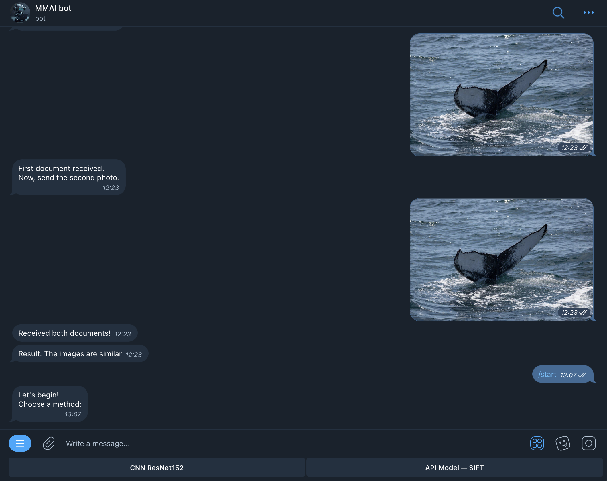
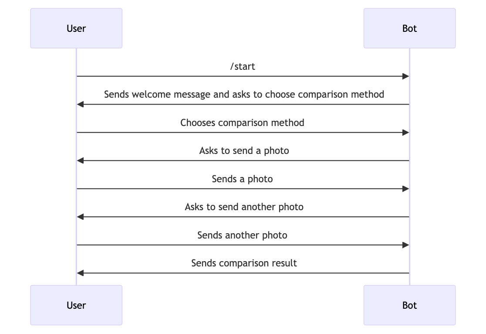

# Telegram Bot for Whale Tail Classification System 

## Requirements

(Optional) Create a virtual environment for the project using Conda.
    
```bash
conda create -n whale-tail python=3.8
conda activate whale-tail
```

Install the required dependencies by running:
```bash
pip install -r requirements.txt
```

## Environment Variables

You are provided with a [.env-example](./.env-example) file. Rename it to `.env` and fill in the required values.

```bash
BOT_TOKEN=your_token
MODEL_PATH=./path/to/cnn/model
ENDPOINT=https://api.com/address
```

## Usage:

After installing the required dependencies and setting up the environment variables, you can run the script using:

```bash
python main.py
```

## Demo

Telegram bot can be found at: [t.me/mmai_team_bot](https://t.me/mmai_team_bot)

This image shows a demo of the Telegram Bot in action:



## User interaction with the bot:



1. User sends `/start` command to the bot.
2. Bot sends a welcome message and asks the user to choose comparison method.
3. User chooses a comparison method.
4. Bot asks the user to send a photo.
5. User sends a photo.
6. Bot asks the user to send another photo.
7. User sends another photo.
8. Bot sends a message with the result of the comparison.